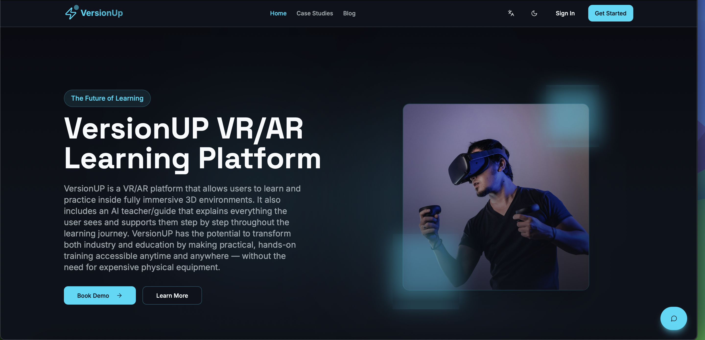
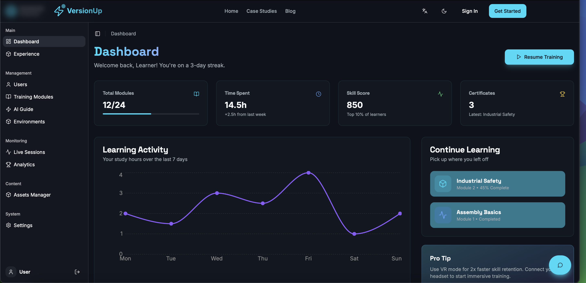

# NextVerse 🥽🌐

<div align="center">
  
  <br/><br/>
  
  <br/><br/>
  <div style="display: flex; justify-content: center; gap: 20px;">
    
    
  </div>
</div>

NextVerse is a cutting-edge VR/AR platform designed to revolutionize education and industrial training. By leveraging immersive 3D environments and an intelligent AI guide, NextVerse enables users to learn and practice complex skills anytime, anywhere.

## 🌟 Features

- **Immersive 3D Environments**: Explore high-fidelity virtual spaces like modern hangars and industrial facilities.
- **AI Assistant**: An intelligent guide that explains concepts, answers questions, and supports your learning journey in real-time.
- **Interactive Learning**: Hands-on practice with virtual equipment (e.g., Robotic Arms, Safety Modules).
- **Multi-language Support**: Accessible in English, French, and Arabic.
- **Dashboard & Analytics**: Track progress, manage assets, and view learning analytics.
- **Photo to 3D**: Convert photos into 3D assets for your environments.

## 🛠️ Tech Stack

- **Frontend**: React, TypeScript, Vite
- **Styling**: Tailwind CSS, Shadcn UI
- **3D/VR**: React Three Fiber, Three.js
- **Backend/Auth**: Supabase
- **Internationalization**: i18next

## 🚀 Getting Started

### Prerequisites

- Node.js (v18 or higher)
- npm or bun

### Installation

1. Clone the repository:
   ```bash
   git clone https://github.com/yourusername/immersive-learniverse.git
   cd immersive-learniverse
   ```

2. Install dependencies:
   ```bash
   npm install
   # or
   bun install
   ```

3. Set up environment variables:
   Create a `.env` file based on your Supabase configuration.

4. Run the development server:
   ```bash
   npm run dev
   # or
   bun dev
   ```

## 📂 Project Structure

- \`src/components/vr\`: VR and 3D scene components.
- \`src/components/ui\`: Reusable UI components (Shadcn).
- \`src/pages\`: Application pages (Dashboard, Login, Experience, etc.).
- \`src/integrations/supabase\`: Supabase client and type definitions.
- \`src/locales\`: Translation files.

## 🤝 Contributing

Contributions are welcome! Please feel free to submit a Pull Request.

## 📄 License

This project is licensed under the MIT License.

